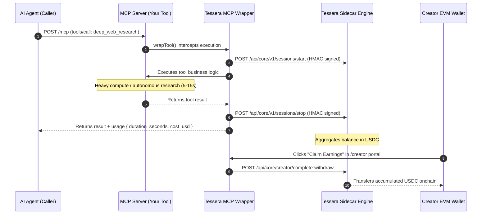

# mcp-plugin-tessera

<div align="center">

[](https://github.com/JaDi03/mcp-plugin-tessera)
[](https://www.npmjs.com/package/mcp-plugin-tessera)
[](LICENSE)
[](https://nodejs.org)

[](https://www.typescriptlang.org/)
[](https://modelcontextprotocol.io)
[](https://try-tessera.xyz)

</div>

**Universal monetization connector and per-second billing middleware for Model Context Protocol (MCP) servers.**

> **TL;DR:** `mcp-plugin-tessera` allows any MCP server creator to monetize autonomous AI agent usage with gas-free per-second micro-billing in USDC via the Tessera engine, featuring an embedded creator claim portal.

---

## Table of Contents

- [Key Features](#-key-features)
- [How It Works](#-how-it-works)
- [Quick Start](#-quick-start)
- [Project Structure](#-project-structure)
- [Creator Portal & Claim Widget](#-creator-portal--claim-widget)
- [Transparent Fee Structure](#-transparent-fee-structure)
- [Tech Stack](#-tech-stack)
- [License](#-license)

---

## ?? Key Features

- **Standard Compliant**: Zero invasive modifications to MCP core tool logic.
- **Pay-per-Second Metering**: Accurately measures live compute duration and bills in real-time.
- **HMAC SHA-256 Ingest**: Secure signed communication with the Tessera sidecar microservice.
- **Creator Earnings Portal**: Built-in dark/gold dashboard to view accumulated earnings and trigger onchain withdrawals.
- **Configurable Tool Rates**: Override default rates per individual MCP tool.

---

## ?? How It Works



---

## ?? Quick Start

### 1. Installation

```bash
npm install mcp-plugin-tessera
```

### 2. Wrap Your MCP Server (3 Lines)

```typescript
import { McpServer } from "@modelcontextprotocol/sdk/server/mcp.js";
import { createTesseraWrapper } from "mcp-plugin-tessera";
import express from "express";

// 1. Initialize connector
const tessera = createTesseraWrapper({
  sidecarUrl: process.env.TESSERA_URL || "http://localhost:7878",
  webhookSecret: process.env.TESSERA_SECRET,
  payoutWallet: process.env.TESSERA_PAYOUT_WALLET,
  defaultRatePerSecond: 0.002, // $0.002/s in USDC
});

const server = new McpServer({ name: "my-mcp-server", version: "1.0.0" });

// 2. Wrap any tool handler with automatic lifecycle billing
server.tool(
  "my_tool",
  toolSchema,
  tessera.wrapTool("my_tool", async (args) => {
    return await executeHeavyTask(args);
  })
);

// 3. Mount creator claim portal
const app = express();
app.use("/creator", tessera.createAdminRouter());
```

---

## ??? Project Structure

```
mcp-plugin-tessera/
+-- .github/
¦   +-- workflows/
¦       +-- ci.yml               # Automated CI pipeline
+-- src/
¦   +-- index.ts                 # Package entrypoint
¦   +-- middleware.ts            # Tool interceptor & wrapper
¦   +-- sidecar-client.ts        # HMAC SHA-256 sidecar client
¦   +-- types.ts                 # TypeScript type definitions
¦   +-- admin/
¦       +-- router.ts            # Express router for Creator Portal & Relay
¦       +-- public/              # Creator Portal UI
¦           +-- index.html       # Dashboard interface
¦           +-- style.css        # Tessera dark/gold theme
¦           +-- app.js           # Live balance polling & claim handler
+-- .env.example
+-- .gitignore
+-- .nvmrc
+-- CONTRIBUTING.md
+-- Dockerfile
+-- LICENSE
+-- package.json
+-- tsconfig.json
```

---

## ?? Transparent Fee Structure

- **Agent Compute**: Billed strictly by active seconds of tool execution (e.g. $0.002/second).
- **Tessera Settlement**: Micro-deductions are batched offchain to eliminate per-transaction gas fees.
- **Creator Withdrawals**: Settled onchain via Circle Gateway into the configured EVM wallet address.

---

## ??? Tech Stack

- **[TypeScript](https://www.typescriptlang.org/)**: Type-safe development.
- **[Model Context Protocol](https://modelcontextprotocol.io)**: Open standard for AI agent tool execution.
- **[Express](https://expressjs.com/)**: Lightweight HTTP router for admin portal.
- **[Tessera](https://try-tessera.xyz)**: Decentralized real-time micro-billing engine.

---

## ?? License

MIT © [JaDi03](https://github.com/JaDi03)
